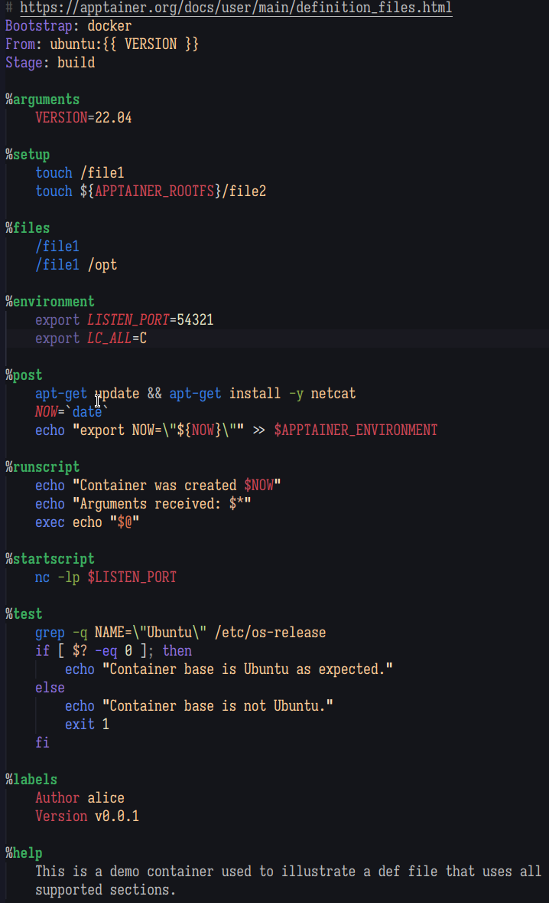

# vscode-apptainer README

This extension provides syntax highlighting for Apptainer/Singularity definition files. Improved syntax highlighting for sections that include shell scripts is provided by Visual Studio Code's built-in shell script syntax highlighting.

## Preview

## Known Issues

- Template strings are not highlighted correctly if they appear on the same line as a header or a section name.
- Template strings are not highlighted within shell scripts.

## Acknowledgements

- [Apptainer](https://github.com/apptainer/apptainer): Test files under `test/from-apptainer` are copied from the Apptainer repository. The extension icon is based on the Apptainer logo.
- [mo](https://github.com/tests-always-included/mo) by [Tests Always Included](https://github.com/tests-always-included/mo): A mustache templating engine in Bash. Used here to replace template strings with values. Included under `template/mo`.
- [Semantic Rainbow](https://github.com/Thertzlor/semantic-rainbow) by [Thertzlor](https://github.com/Thertzlor): A Visual Studio Code color theme. Used here in the preview image.
- [yq](https://github.com/mikefarah/yq) by [Mike Farah](https://github.com/mikefarah): A YAML processor in Go. Used here to transform language definitions from YAML to JSON.

## See also

- [vscode-singularity](https://github.com/onnovalkering/vscode-singularity) by [Onno Valkering](https://github.com/onnovalkering) also provides syntax highlighting for Singularity definition files and was used as a reference while developing this extension.
